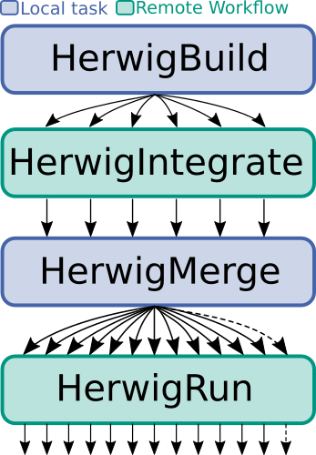
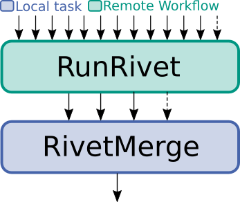
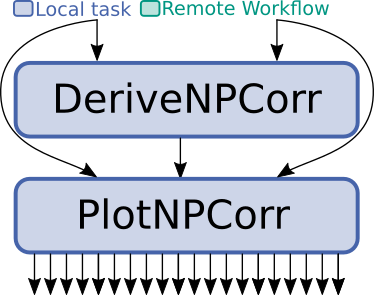

# Herwig event generation and Rivet analysis


Repository for tracking the development of distributable MC event generation with [Herwig7](https://herwig.hepforge.org/).


## Herwig Docker image

This repository provides a Docker image for running standalone Herwig. 
See also the linked [Docker hub](https://hub.docker.com/repository/docker/mhorzela/herwig-standalone). 
This image contains a full installation of Herwig with all necessary linked software components. 
Since the size of the docker image is quite big (aprox. 8.5GiB) it might not be the best option 
to use for distributed execution in a batch system. 


## LAW setup

For automated and distributed production of HEP-particle-collision events with Herwig, 
exploiting all functionality, an implementation of the workflow using [LAW](https://github.com/riga/law) is provided.

### Software dependencies
In the following the setup of needed software is explained.

#### Herwig7
The necessary [Herwig7](https://herwig.hepforge.org/) software is loaded from CVMFS (`/cvmfs/etp.kit.edu/herwig`) in the `setup/setup_herwig.sh` script 
for local execution and `generation/setup_lawherwig.sh` for remote jobs.
If you want to load the Herwig7 software differently, you need to change the according lines in **both** scripts.

#### Rivet
In a similar way the analysis software [Rivet](https://gitlab.com/hepcedar/rivet/)  is also loaded from CVMFS (`/cvmfs/sft.cern.ch/lcg/releases/LCG_96b/MCGenerators/rivet/`) in the `setup/setup_rivet.sh` script for local execution and `generation/setup_lawrivet.sh` for remote jobs.
These also need to be adjusted, if you want to use Rivet from a different source.

#### Law, Luigi, Six and Enum34
The necessary software for LAW is on one hand loaded as `git submodules` in `law`, `luigi` and `six`. 
These can be loaded by executing 
```bash
git submodule init
git submodule update
```
or setting the submodules while cloning the repository with the  `--recurse-submodules` option.

On the other hand Enum34 is included in `enum34-1.1.10` as part of the repository and will be cloned as such.


### Running the generation

#### Framework
An HTCondor and file-IO interface for LAW are specified in `generation/framework.py`. 
There the HTCondor system and the file IO are interfaced to LAW.
LAW also provides support for other file and batch systems, but you need to define these by your own, in case you need it.

#### Tasks and Workflows


##### Herwig7



Running Herwig7 automatically and distributed on a batch system involves four steps:
- *HerwigBuild*: First, in a *build* step the necessary matrix elements (MEs) libraries for the hard scattering process are generated and compiled. Moreover the handling to the further generation steps is configured and further steps are prepared. This is run locally.
- *HerwigIntegrate*: Second, grids for the prepared MEs are *integrate*d for a convergent phase-space integration. Since this can be computationally quite expensive, this is distributedly executed on the batch system for a given subprocess splitting.
- *HerwigMerge*: Third, the splitted integration grids are *merge*d to a single integration grid, which can be used for the last step. This is run locally.
- *HerwigRun*: Fourth and last, the fully prepared integration grid is used to *run* the phase-space integration and generate events.

##### Rivet



The analysis of generated HepMC files by Herwig is executed distributedly on a batch system. This involves two steps:
- *RunRivet*: First the specified Rivet plugins are run on the collection of generated HepMC files, which will produce the histograms, scatter objects and counters defined in the according plugin in the YODA format. This is done distributedly on the batch system. The amount of files to analyze per job can be specified in the steering file, with the aim to avoid very short jobs, which might bother the batch system.
- *RivetMerge*: The distributedly produced YODA files are gathered and merged to a single YODA file, which contains the whole statistics of the generated and analyzed events. This is done locally in configrable chunks, which are then recursively merged to provide the fully merged file in the end.

The according code for these tasks and workflows is defined in `generation/tasks`.

##### Further Processing



Further processing of the produced YODA files is supported by the task:
- *DeriveNPCorr*: It calculates the ratio of two separate MC productions, i.e. for the derivation of non-perturbative correction factors, using the functionality provided by the [`YODA` API](https://yoda.hepforge.org/). You can specify match and unmatch regular expressions to filter the analysis objects to process. It will create a new `.yoda` file containing the creted ratio analysis objects.

##### Plotting
Tasks for plotting with the functionality provided by the `matplotlib` python library and input file handling with the [`YODA`](https://yoda.hepforge.org/) toolset:
- *PlotNPCorr*: This reads in the ratio analysis objects derived in the `DeriveNPCorr` task and plots them. With the `--filter-label-pad-tuples` option a tuple of tuples is specified. Its first two components are regexes which filter the analysis objects to plot by matching and unmatching. The third component is a label string interpreted in LaTex math mode to plot on the x-axis of the plot. The fourth component is a string to be put as the y-axis label. The fifth component is an optional string. When set, also the two original distributions used to derive the ratio are plotted in a top pad. The according y-axis label is taken to be the specified string. Example: `'(("ZPt","RAW","p_T^Z\,/\,\mathrm{GeV}","NP corr.","\mathrm{arb. units}"),("PhiStarEta","RAW","\phi^*_\eta","NP corr."))'`

#### Configuration
All important parameters for the execution of the automated generation are set in `luigi.cfg`. 
Make sure to adjust the following parameters before starting the generation:

*Grid parameters*. In case you want to run the setup on the grid you will need to set the following parameters:
- `wlcg_path`: Since the intermediate and final outputs of the tasks are gathered on a grid storage you will specify here, you need to set the path to your personally reachable one.
- `htcondor_user_proxy`: To establish your identity on the grid, you need to specify your valid VOMS grid proxy.

*HTCondor parameters*. Depending on the configuration of your HTCondor batch system you will need to set the according parameters:
- `htcondor_accounting_group`: In case you have accounting groups configured, make sure to set this to yours.
Set these to a higher value than you expect a single *integrate* or *run* job to run:
- `htcondor_walltime`: This is the (maximum) time your jobs are allowed to run on a batch node. 
- `htcondor_request_memory`: This is the (maximum) amount of memory in MiB your job is allowed to access on the remote node.
- `htcondor_request_disk`: This is the (maximum) number of disk space your job is allowed to occupy.
Additional requirements for selecting worker nodes:
- `htcondor_requirements`: Here you can specify additional requirements on your target machines. 

*Run specific parameters*. Set these to your desired values, to configure your personal generation of events.
- `config_path`: This is the path to the directory, which includes your Herwig inputfile. If not set, this defaults to `inputfiles`
- `input_file_name`: This is the name of your Herwig inputfile **AND** corresponding runfile (this usually needs some configuration in the `saverun` command of your Herwig input file) without the file extensions.
- `mc_setting`: You can set this parameter, if you want to specify further splitting in subdirectories for your outputs for different runs.
- `integration_maxjobs`: With this you specify the splitting of the subprocesses and therefore the number of distinct integration jobs.
- `number_of_jobs`: Set the number of jobs generating MC events with this parameter. Each job will be executed seperately on the batch system.
- `events_per_job`: Overwrite the number of events generated with each generation job.
- `start_seed`: Currently not used. Purposed for the use of randomly generated seeds for generation jobs.

*Analysis specific parameters*. Set these to steer the analysis of your generated HepMC events.
- `rivet_analyses`: List of Rivet plugins you want to run on your generated HepMC files. If you want to run your own analysis make sure to put your compiled `RivetAnalysis.so` to the `analyses` directory.
- `files_per_job`: Number of HepMC files to be analyzed by a single Rivet job. Usually Rivet runs very fast (order of 1000 events per minute). If your HepMC files contain only a small number of events you can ensure here, to run Rivet jobs on the desired number of events.
- `chunk_size`: Number of simultaneously merged YODA files to avoid running into the argument limit of the subprocess or the CLI.

*Processing and Plotting parameters*. Set these to steer the further processing of the `.yoda` files generated in the Rivet analyses.
- `match`: Regular expression string which must match the analysis objects' names to process.
- `unmatch`: Regular expression string which must not match the analysis objects' names to process.
- `mc_setting_full`: `mc_setting` used for the derivation of the `.yoda` file containing the full simulation's outcomes
- `mc_setting_partial`: `mc_setting` used for the derivation of the `.yoda` file containing the partial simulation's outcomes
- `filter_label_pad_tuples`: Tuple of tuples containg either four or five entries:
    - the filters for identification of the analysis objects to plot, match and unmatch,
    - the x- and y-axis labels for the ratio pad (showing i.e. the NP-correction),
    - OPTIONAL: the label for a top pad showing the original distributions used to derive the ratio
    `(("match", "unmatch", "xlabel", "ylabel", ["origin-ylabel"]), (...), ...)`, e.g. `'(("ZPt","RAW","p_T^Z\,/\,\mathrm{GeV}","NP corr.","\mathrm{arb. units}"),("PhiStarEta","RAW","\phi^*_\eta","NP corr."))'`

#### Executing LAW
You are now ready to run your configured generation workflow. Set the law environment by `source setup.sh`.
To index the available LAW tasks and workflows, first execute `law index`, which will also enable autocompletion. 
To start the generation you can now simply run
```
law run HerwigRun
```
This will start all previous steps in the necessary order and produce `.hepmc` files according to your configuration.

For the concurrent analysis of the generated events, simply execute
```
law run RivetMerge
```
, which will provide you the desired analysis outputs once finished.

Alternatively you can also run each step seperately in the following order,
```
law run HerwigBuild
law run HerwigIntegrate
law run HerwigMerge
law run HerwigRun
law run RunRivet
law run RivetMerge
```
which will effectively give the same results. This is only recommended for debugging reasons, since Law will automatically take care of the whole generation and analysis chain, which also includes the parameter and dependecy handling.
