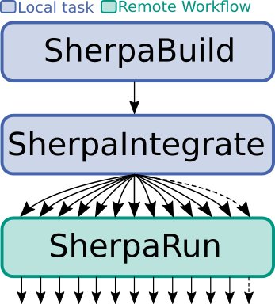

# Scalable MC event generation and Rivet analysis


This repository provides a workflow management implementation for distributable MC event generation with [Herwig7](https://herwig.hepforge.org/) and [Sherpa](https://sherpa-team.gitlab.io/) and subsequent analysis with [Rivet](https://rivet.hepforge.org/).


<!-- ## Herwig Docker image

This repository provides a Docker image for running standalone Herwig. 
See also the linked [Docker hub](https://hub.docker.com/repository/docker/mhorzela/herwig-standalone). 
This image contains a full installation of Herwig with all necessary linked software components. 
Since the size of the docker image is quite big (aprox. 8.5GiB) it might not be the best option 
to use for distributed execution in a batch system.  -->

The workflow, managing and distributing the event generation and analysis, is implemented in [LAW](https://github.com/riga/law).

## (Software) Dependencies
In the following the setup of needed software is explained.

### Herwig7
The necessary [Herwig7](https://herwig.hepforge.org/) software is loaded from CVMFS (`/cvmfs/etp.kit.edu/herwig`) in the `setup/setup_herwig.sh` script 
for local execution and `generation/setup_lawherwig.sh` for remote jobs.
If you want to load the Herwig7 software from other sources, you need to change the according lines in **both** scripts.

### Sherpa
[Sherpa](https://sherpa-team.gitlab.io/) is loaded from CVMFS but is sourced as a part of [CMSSW](https://github.com/cms-sw/cmssw).
The corresponding scripts setting up Sherpa are found in `/work/mhorzela/mc-run/setup/setup_sherpa.sh` and `/work/mhorzela/mc-run/generation/setup_lawsherpa.sh` for local execution and remote jobs, respectively.
The dependencies for Sherpa include `mpirun` that allows to run integration in parallel.
If you want to load Sherpa from another source you need to adjust these two bash scripts.

### Rivet
In a similar way, the analysis software [Rivet](https://gitlab.com/hepcedar/rivet/) is loaded from CVMFS (`/cvmfs/sft.cern.ch/lcg/releases/LCG_96b/MCGenerators/rivet/`) in the `setup/setup_rivet.sh` script for local execution and `generation/setup_lawrivet.sh` for remote jobs.
These also need to be adjusted, if you want to use Rivet from a different source.

### Law, Luigi, Six and Enum34
The necessary software for LAW, in which the workflow and file I/O handling is implemented, is on one hand loaded as `git submodules` in `law`, `luigi` and `six`. 
These can be loaded by executing 
```bash
git submodule init
git submodule update
```
or setting the submodules while cloning the repository with the  `--recurse-submodules` option.

On the other hand Enum34 is included in `enum34-1.1.10` as part of the repository and will be cloned as such without requiring further directives.

### HTCondor
[HTCondor](https://github.com/htcondor/htcondor) is used to distribute the individual jobs created in the workflow to the executing machines.
It needs to be installed on your system for LAW being able to execute the event generation and analysis.
Individual values for job parameters that need to be considered in 

### Grid-Transfer Protocols/Tools & Storage
The provisioning of the input and output files for the individual jobs is automatically handled by LAW using [GFAL2](https://github.com/cern-fts/gfal2) under the hood.
Consequently, your systems need to be able to run GFAL2 with support for at least one Grid-transfer protocol, e.g. XRootD, WebDAV, that is used to access to read and write files onto a storage system accessible via this protocol from both your local machine as well as your distributed worker nodes.


## Running the generation

### Framework
HTCondor and file-IO interfaces for LAW are specified in `generation/framework.py`.
There the HTCondor system and the file IO directives of the local computing setup are interfaced to LAW.
Depending on your computing system configuration it might be necessary to adjust them.

LAW also provides support for other file and batch systems, but you need to define these by your own, in case you need it.

Unless you need any additional individual adjustments all other software dependencies are taken care of with the provided default configuration.

### Tasks and Workflows

The workflow consists of a set of tasks interconnected by directed dependencies (requirements) with other tasks.
To give a simple example, before the event analysis an event generation task has to be executed successfully in order for an output to exist for analysis.
The analysis "requires" a event generation task.
The event generation taks on its hand, has other dependencies which need to be fulfilled before its execution, e.g. the existence of an MC integration grid and a generator configuration.

Similar tasks, e.g. all event generation taks for the same MC campaign with the same generator, are grouped into a so-called "LAW workflow", not to be confused with the overarching workflow implemented in this framework.
Several groups of tasks can have additional overarching requirements for the whole collection of tasks.
These can require other collections of tasks to be finished or single tasks.

The general behaviour of these requirements is implemented into the software framework and doesn't need to be steered by the user.
However, each task and collection of tasks are subject to certain steerable parameters used to set the workflow.
Once defined by the user, the software will take care of resolving the requirements and running everything up to the required point (task or collection of tasks) in the workflow.
The runnable (collections of) tasks and their parameters are presented in the following:


#### Herwig7


Running Herwig7 automatically and distributed on a batch system involves four steps:
- *HerwigBuild*: First, in a *build* step the necessary matrix elements (MEs) libraries for the hard scattering process are generated and compiled. Moreover the handling to the further generation steps is configured and further steps are prepared. This is run locally.
- *HerwigIntegrate*: Second, grids for the prepared MEs are *integrate*d for a convergent phase-space integration. Since this can be computationally quite expensive, this is distributedly executed on the batch system for a given subprocess splitting.
- *HerwigMerge*: Third, the splitted integration grids are *merge*d to a single integration grid, which can be used for the last step. This is run locally.
- *HerwigRun*: Fourth and last, the fully prepared integration grid is used to *run* the phase-space integration and generate events.

#### Sherpa



Alternatively, Sherpa can be automatically run on the batch system.
Since Sherpa cannot run the generation fo integration grids distributedly no merge step is needed.
Therefore, there exist only three steps:
- *SherpaBuild*: Here similar to Herwig7 the MEs and software dependencies are loaded and *built*.
- *SherpaIntegrate*: The potentially computationally expensive creation of *integration* grids are run locally. Parallelism is achieved by running the integration with `mpirun`.
- *SherpaRun*: This last step ultimately uses the previously built software and integration grids to *run* the event generation.


#### Rivet


The analysis of generated HepMC files by Herwig is executed distributedly on a batch system. This involves two steps:
- *RunRivet*: First the specified Rivet plugins are run on the collection of generated HepMC files, which will produce the histograms, scatter objects and counters defined in the according plugin in the YODA format. This is done distributedly on the batch system. The amount of files to analyze per job can be specified in the steering file, with the aim to avoid very short jobs, which might bother the batch system.
- *RivetMerge*: The distributedly produced YODA files are gathered and merged to a single YODA file, which contains the whole statistics of the generated and analyzed events. This is done locally in configrable chunks, which are then recursively merged to provide the fully merged file in the end.

The according code for these tasks and workflows is defined in `generation/tasks`.

#### Post-Processing


Further processing of the produced YODA files is supported by the task:
- *DeriveNPCorr*: It calculates the ratio of two separate MC productions, i.e. for the derivation of non-perturbative or EWK correction factors, using the functionality provided by the [`YODA` API](https://yoda.hepforge.org/). You can specify lists of match and unmatch regular expressions to filter the analysis objects to process. It will create a new `.yoda` file containing the created ratio analysis objects.

#### Plotting
Tasks for plotting with the functionality provided by the `matplotlib` python library and input file handling with the [`YODA`](https://yoda.hepforge.org/) toolset are provided.
They can be used to further process whatever has been generated and analysed with the MC event generators and Rivet.
Three plot tasks are implemented:
- *PlotNPCorr*: This reads in the ratio analysis objects derived in the `DeriveNPCorr` task and plots them. With the `--filter-label-pad-tuples` option a tuple of tuples is specified. Its first two components are regexes which filter the analysis objects to plot by matching and unmatching. The third component is a label string interpreted in LaTex math mode to plot on the x-axis of the plot. The fourth component is a string to be put as the y-axis label. The fifth component is an optional string. When set, also the two original distributions used to derive the ratio are plotted in a top pad. The according y-axis label is taken to be the specified string. Example: `'(("ZPt","RAW","p_T^Z\,/\,\mathrm{GeV}","NP corr.","\mathrm{arb. units}"),("PhiStarEta","RAW","\phi^*_\eta","NP corr."))'`. When multiple analysis objects with a matching name exist, they can be split by specifying a splitting as a JSON dictionary. Before plotting a fit of a power law to each ratio distributions is attempted. The fit results can be stored separately by specifying a path for each plotted analysis object.
- *PlotNPCorrSummary*: This tasks plots multiple of the fitted ratio distributions in the same canvases. A dictionary of splittings spcifies which analysis objects have to be plotted in which canvas.
- *PlotScenarioComparison*: This task allows to plot a summary plot of the same analysis objects created by multiple MC event generators in multiple campaigns.


### Configuration
All important parameters for the execution of the automated generation are set in the steering file `luigi.cfg`.
It is ordered in blocks containing the parameter values for each task/collection of tasks.
They can be overwritten by explicitely setting a value in the command-line interface (CLI).
Make sure to adjust the following parameters before starting the generation:

#### Computing parameters
In case you want to run the setup on a distributed platform, e.g. the grid, you will need to set the following parameters:
- `wlcg_path`: Since the intermediate and final outputs of the tasks are gathered on a storage accessible in a distributed system, you need to set the prefix-path to this reachable storage. In case you are running everything locally, it can just be `file://`.
- `htcondor_user_proxy`: To establish your identity on the grid, you might need to specify your valid VOMS grid proxy location.

#### HTCondor parameters
Depending on the configuration of your HTCondor batch system you will need to set the according parameters:
- `htcondor_accounting_group`: In case you have accounting groups configured, make sure to set this to yours. Other users might get upset by you killing their quota.
Set these to a higher value than you expect a single *integrate*, *run*, or *analysis* job to run:
- `htcondor_walltime`: This is the (maximum) time your jobs are allowed to run on a (remote) worker node. 
- `htcondor_request_memory`: This is the (maximum) amount of memory in MiB your job is allowed to access on the (remote) worker node.
- `htcondor_request_disk`: This is the (maximum) number of disk space your job is allowed to occupy.
Additional requirements for selecting worker nodes:
- `htcondor_requirements`: Here you can specify additional requirements on your target machines. 

#### Run specific parameters
Set these to your desired values, to configure your personal generation of events.
- `mc_generator`: Choose the MC event generator (`herwig` or `sherpa`) to use for the event generation.
- `config_path`: This is the path to the directory, which includes your Herwig inputfile or the parent directory of your Sherpa workspace. If not set, this defaults to `inputfiles/[mc_generator]`
- `campaign`: This is the name of your Herwig inputfile **AND** corresponding runfile (this usually needs some configuration in the `saverun` command of your Herwig input file) without the file extensions or Sherpa's run directory.
- `mc_setting`: You can set this parameter, if you want to specify further splitting in subdirectories for your outputs for different runs.
- `integration_maxjobs`: With this you specify the splitting of the subprocesses and therefore the number of distinct integration jobs.
- `number_of_jobs`: Set the number of jobs generating MC events with this parameter. Each job will be executed seperately as a statistically independent entity on the batch system.
- `events_per_job`: Set the number of events generated with each generation job.
<!-- - `start_seed`: Currently not used. Purposed for the use of randomly generated seeds for generation jobs. -->

#### Analysis specific parameters
Set these to steer the analysis of your generated HepMC events.
- `rivet_analyses`: List of Rivet plugins you want to run on your generated HepMC files. If you want to run your own analysis make sure to put your compiled analyses (contained in e.g. the `RivetAnalysis.so` file) to the `analyses` directory.
- `files_per_job`: Number of HepMC files to be analyzed by a single Rivet job. Usually Rivet runs very fast (order of >1000 events per minute). If your HepMC files contain only a small number of events you can ensure here, to run Rivet jobs on the desired number of events.
- `chunk_size`: Number of simultaneously merged YODA files to avoid running into the argument limit of the subprocess, the cache limit, or the CLI limit.

#### Post-Processing and Plotting parameters
Set these to steer the further processing of the `.yoda` files generated in the Rivet analyses.
- `match`: List of regular expression strings which must match the analysis objects' names to process.
- `unmatch`: List of regular expression strings which must not match the analysis objects' names to process.
- `mc_setting_full`: `mc_setting` used for the derivation of the `.yoda` file containing the full simulation's outcomes in the nominator of the ratio distribution.
- `mc_setting_partial`: `mc_setting` used for the derivation of the `.yoda` file containing the partial simulation's outcomes in the denominator of the ratio distribution.
- `filter_label_pad_tuples`: Tuple of tuples containg either four or five entries:
    - the filters for identification of the analysis objects to plot, match and unmatch,
    - the x- and y-axis labels for the ratio pad (showing i.e. the NP-correction),
    - OPTIONAL: the label for a top pad showing the original distributions used to derive the ratio
    `(("match", "unmatch", "xlabel", "ylabel", ["origin-ylabel"]), (...), ...)`, e.g. `'(("ZPt","RAW","p_T^Z\,/\,\mathrm{GeV}","NP corr.","\mathrm{arb. units}"),("PhiStarEta","RAW","\phi^*_\eta","NP corr."))'`
- `splittings_all`: JSON dictionary containing an identifier as key and a dictionary specifying 
    - an identyfier for a YODA analysis object
    - and plotting options like
        - marker style and type
        - color
        - y-limit
        - and label
  Predefined splittings (in `framework/config.py`) can be chosen by giving the corresponding identifier for the predefined set.
- `fit_method`: Choose an optimizer for fitting ratio distributions with a power law. Choices: `BFGS`, `Nelder-Mead`, and `trust-exact`
- `fits`: Dictionary matching each `splittings_all` key to a file-path in which the fit results are stored.
- `splittings_summary`: JSON dicttionary of dictionaries in the style of `splittings_all` identifying the analysis objects to be plot into a single canvas.

A cartesian product is computed from the following two. So, in order to not be empty you need to specify at least one value for both:
- `mc_generators`: Generators to be compared in a summary plot.
- `campaigns`: MC event generation campaigns to be compared.


### Executing LAW
To run your configured generation workflow. Set the law environment by `source setup.sh`.
To index the available LAW tasks and workflows, first execute `law index`, which will also enable autocompletion for the tasks' parameters. 
To start the generation you can now simply run
```
law run HerwigRun
```
This will start all previous steps in the necessary order and produce `.hepmc` files according to your configuration.

You can also start with the execution of the analysis of (not yet) generated events, simply execute
```
law run RivetMerge
```
, which will provide you the desired analysis outputs once all the necessary events have been generated and their subsequent analysis has finished.
Of course, in all cases all necessary parameters have to be specified.

#### Overwriting parameters via the CLI
Parameter values for a task can be overwritten via the CLI by setting the value as a command-line option derived from the parameter's name.
For example, the `chunk_size` for the RivetMerge task can be set via the CLI by setting a new value of 50, via:
```
law run RivetMerge --chunk-size 50
```
Similarly, the parameter values for required tasks and their required tasks can be set.

If you want to specify a parameter specifically for a required task somewhere in the chain, this can be steered in the CLI by adding the task's name to the parameter option as a prefix.
This will overwrite whatever parameter value you have set for this task in the `luigi.cfg`.
For example, say you want to create a single YODA file containing the analysis results of 1 Billion events and you have tweaked your HTCondor parameters to run well with event generation jobs each generating 10k events, execute
```
law run RivetMerge --HerwigRun-events-per-job 10000 --HerwigRun-number-of-jobs 100000
```
and lean back while waiting for completion.


#### Micromanaging
You can also run each step seperately in the following order,
```
law run HerwigBuild
law run HerwigIntegrate
law run HerwigMerge
law run HerwigRun
law run RunRivet
law run RivetMerge
```
which will effectively give the same results. This is only recommended for debugging reasons, since Law will automatically take care of the whole generation and analysis chain, which also includes the parameter and dependecy handling.
So why would you want to waste your precious time micro-managing the workflow?
